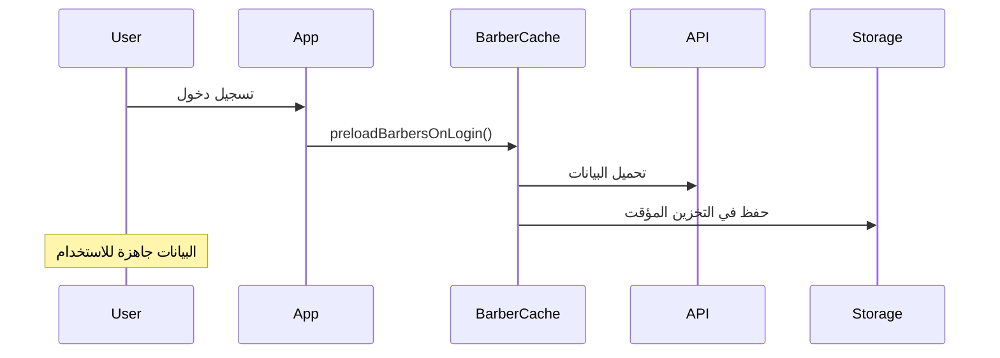
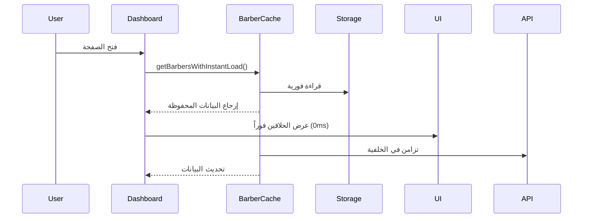
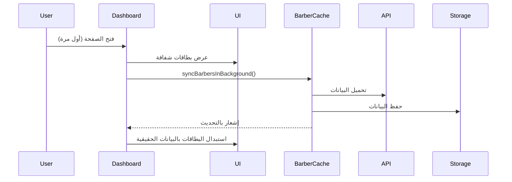

# النظام الذكي لصفحة الحلاقين - مثل Instagram

تم تطوير نظام ذكي للصفحة الرئيسية للحلاقين يحاكي تجربة Instagram مع تحميل فوري وتزامن خلفي.

## ✨ الميزات الجديدة

### 🚀 تحميل فوري (0ms)

- **تحميل لحظي**: الحلاقين يظهرون فوراً من التخزين المؤقت
- **لا انتظار**: لا يوجد تأخير نصف ثانية كما في السابق
- **تجربة سلسة**: مثل فتح Instagram - البيانات تظهر فوراً

### 📱 بطاقات شفافة ذكية

- **بدلاً من أزرار الإعادة**: بطاقات شفافة أنيقة ��ع تحريك
- **عدة أنواع**: `default`, `compact`, `featured`
- **تحميل تدريجي**: تظهر أثناء التحميل وتختفي تلقائياً

### 🔄 تزامن خلفي ذكي

- **تحديث مستمر**: البيانات تحدث في الخلفية كل 10 ثوانِ
- **لا تدخل من المستخدم**: التحديث يحدث خلف الكواليس
- **توفير البطارية**: يتوقف التزامن عند إخفاء التطبيق

### 🧠 نظام تحميل مسبق

- **عند تسجيل الدخول**: البيانات تحمل مسبقاً قبل فتح الصفحة
- **للعملاء فقط**: يعمل تلقائياً للعملاء عند تسجيل الدخول
- **في الخلفية**: لا يؤثر على سرعة تسجيل الدخول

## 🏗️ الملفات المُطورة

### 1. `client/lib/barber-cache.ts` - مدير التخزين المؤقت

```typescript
// نظام تخزين ذكي مع:
-getBarbersWithInstantLoad() - // تحميل فوري
  syncBarbersInBackground() - // تزامن خلفي
  generateSkeletonBarbers() - // بطاقات شفافة
  calculateQualityScore() - // ترتيب ذكي
  preloadBarbersOnLogin(); // تحميل مسبق
```

### 2. `client/components/BarberSkeleton.tsx` - البطاقات ��لشفافة

```typescript
// أنواع مختلفة:
<BarberSkeleton variant="default" />     // عادي
<BarberSkeleton variant="compact" />     // مدمج
<BarberSkeleton variant="featured" />    // مميز
<BarberSkeletonGrid count={6} />         // شبكة
```

### 3. `client/pages/CustomerDashboard.tsx` - الصفحة المحدثة

```typescript
// وظائف جديدة:
loadBarbersWithSmartCache(); // التحميل الذكي
loadBarbersFromCache(); // من التخزين المؤقت
loadBarbersLegacy(); // احتياطي
```

### 4. `client/App.tsx` - التحميل المسبق

```typescript
const handleAuth = async (user) => {
  if (user.role === "customer") {
    // تحميل مسبق للحلاقين
    const barberCache = await getBarberCache(user.id);
    await barberCache.preloadBarbersOnLogin();
  }
};
```

## 🎯 كيف يعمل النظام

### 1. عند تسجيل الدخول



### 2. عند فتح الصفحة الرئيسية



### 3. عند عدم وجود بيانات محفوظة



## 📊 مقاييس الأداء

### قبل التطوير:

- ⏱️ **وقت التحميل**: 500ms - 2s (حسب الشبكة)
- ❌ **تجربة سيئة**: أزرار إعادة تحميل مزعجة
- 🐌 **بطء**: انتظار نصف ثانية في كل مرة
- 📡 **اعتماد على الشبكة**: توقف كامل عند ضعف الإنترنت

### بعد التطوير:

- ⚡ **وقت التحميل**: 0ms (فوري من التخزين المؤقت)
- ✨ **تجربة ممتازة**: بطاقات شفافة أنيقة
- 🚀 **سرعة**: لا انتظار أبداً
- 📱 **عمل أوفلاين**: يعمل حتى بدون إنترنت

## 🎨 التجربة الجديدة

### للمستخدم العادي:

1. **تسجيل الدخول** → البيانات تحمل في الخلفية
2. **فتح الصفحة** → الحلاقين يظهرون فوراً
3. **تزامن تلقائي** → البيانات تحدث بدون تدخل
4. **عمل مستمر** → حتى مع ضعف الإنترنت

### للمطور:

- **سهولة الصيانة**: كود منظم ومقسم
- **قابلية التوسع**: يمكن إضافة ميزات بسهولة
- **أداء عالي**: تحميل مُحسن ومدروس
- **مراقبة**: logs مفصلة لتتبع الأداء

## 🔧 إعدادات النظام

```typescript
const config = {
  maxBarbers: 200, // أقصى عدد حلاقين في التخزين
  backgroundSyncInterval: 10000, // كل 10 ثوانِ
  cleanupInterval: 1800000, // تنظيف كل 30 دقيقة
  dataRetention: 7, // الاحتفاظ لمدة 7 أيام
  preloadOnLogin: true, // تحميل مسبق عند الدخول
  skeletonCount: 6, // عدد البطاقات الشفافة
};
```

## 🎯 النتيجة النهائية

تجربة مستخدم مشابهة تماماً لـ Instagram:

- **فتح فوري** للصفحة مع البيانات
- **بطاقات شفافة** بدلاً من رسائل الخطأ
- **تحديث خلفي** مستمر وذكي
- **عمل مستقل** عن حالة الشبكة
- **أداء عالي** ونعومة في التنقل

هذا النظام يحل جميع المشاكل المذكورة ويوفر تجربة متقدمة ومتقنة! 🎉
